
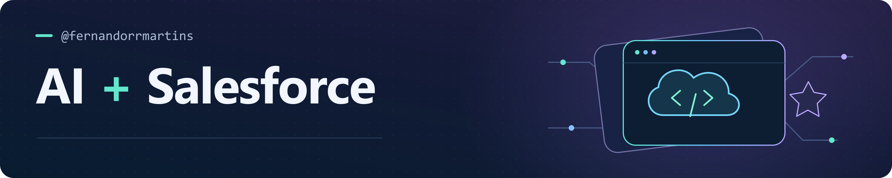

<h1 align="center">Fernando R. R. Martins</h1>

<b>English</b> · <a href="README.pt-BR.md">Português</a>

I build with Salesforce and explore AI for software development. 
🎓 Postgraduate studies in Software Engineering with Applied AI · in progress.

<h3 align="center">Tech stack</h3>

  
  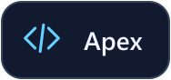
  
  
   
  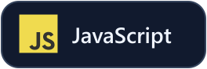
  
  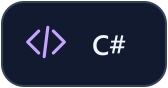
  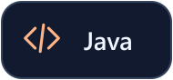
  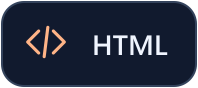
  
  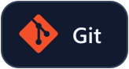

<h3 align="center">AI in my editor</h3>

  
  
  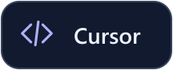
  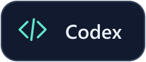

<h3 align="center">Code & projects</h3>

  <a href="https://github.com/fernandorrmartins/salesforce-debug-module">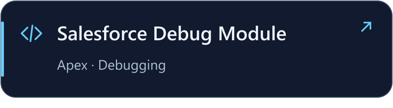</a>
  <a href="https://github.com/Hikari-Family/sfdc-async-mailer">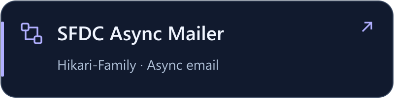</a>
  <a href="https://github.com/fernandorrmartins/RocketSeat-NextLevelWeek-1">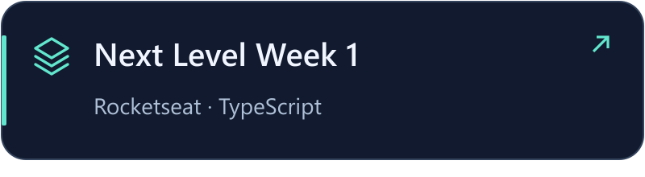</a>
  <a href="https://github.com/fernandorrmartins/OpenTibia-Unity">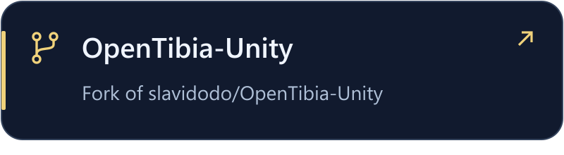</a>

<a href="https://github.com/fernandorrmartins?tab=repositories">All repositories</a> · <a href="https://github.com/fernandorrmartins/salesforce-debug-module/stargazers">Debug Module stars</a> · <a href="https://github.com/fernandorrmartins/salesforce-debug-module/forks">Debug Module forks</a>

<h3 align="center">GitHub activity</h3>

  
  
  
  

Contributions and commits on my profile; stars and forks on repository pages.

<a href="https://www.linkedin.com/in/fernandorrmartins/">Let’s connect ↗</a>

